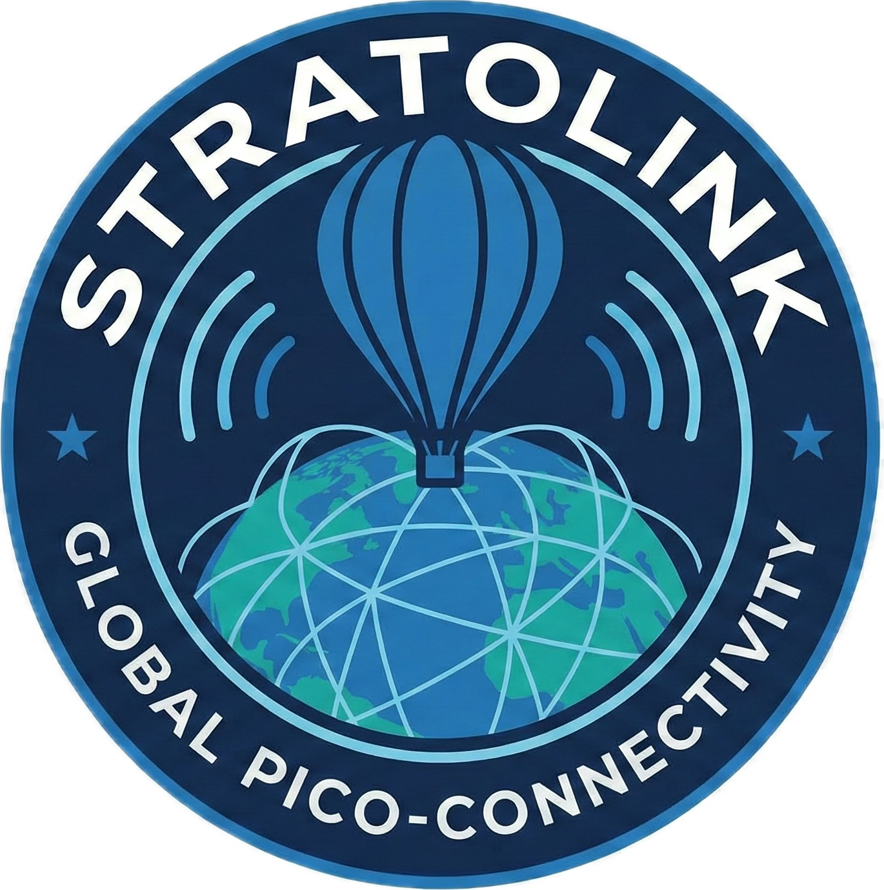

<div align="center">



# Stratolink

**Global Pico-Connectivity**

Global pico-balloon telemetry system using the RAK3172 LoRaWAN module with a web dashboard.

</div>

## Architecture

1. Flight Hardware: RAK3172 (STM32WLE5) microcontroller running Arduino Framework
2. Telemetry Transport: The Things Network (TTN) LoRaWAN
3. Website and Dashboard: Vite, React and Vercel Node functions
4. Database: Supabase PostgreSQL
5. Data Flow: TTN HTTP Webhook -> Authenticated ingestion endpoint -> Supabase -> Public telemetry API

## Repository Structure

```
/stratolink-monorepo
├── /firmware                  # PlatformIO Project (C++)
│   ├── /src
│   │   ├── main.cpp
│   │   ├── region_manager.cpp
│   │   └── power_manager.cpp
│   ├── /include
│   │   ├── config.h           # Template for User Keys
│   │   └── secrets.h          # GITIGNORED
│   ├── platformio.ini
│   └── flash_firmware.bat
├── /assets                    # Brand assets and images
│   └── /images               # Logo and branding files
├── /hardware                  # PCB and Circuit Designs
│   ├── /pcb                   # PCB design files
│   ├── /circuits              # Circuit schematics
│   ├── /3d-models             # Mechanical designs
│   └── /docs                  # Hardware documentation
├── /web                       # Website and dashboard
│   ├── /src/dashboard         # React dashboard
│   ├── /content               # Documentation and blog articles
│   ├── /api                   # Vercel function entry points
│   ├── /server                # Authentication, ingestion and public APIs
│   ├── /lib                   # TTN decoder and forecast worker
│   └── package.json
├── /supabase
│   ├── /migrations            # Applied schema and raw-data privacy migrations
│   └── /platform-hardening    # Separate extension-owner permission changes
├── .gitignore
└── setup_repo.sh
```

## Prerequisites

1. PlatformIO CLI or PlatformIO IDE
2. Node.js 22 for the website
3. Supabase account
4. The Things Network account
5. RAK3172 development board

## Quick Start

### Firmware Setup

1. Navigate to firmware directory: `cd firmware`
2. Copy `include/config.h` values to `include/secrets.h`
3. Edit `include/secrets.h` with your TTN credentials:
   - DEV_EUI
   - APP_EUI
   - APP_KEY
4. Build firmware: `pio run`
5. Upload to device: `pio run --target upload`

### Web Application Setup

1. Navigate to web directory: `cd web`
2. Install dependencies: `ONNXRUNTIME_NODE_INSTALL=skip npm ci`
3. Copy `.env.example` to `.env.local`
4. Configure the public authentication values and server credentials described in [web/README.md](web/README.md#deployment). Keep the service role key server-only.
5. Follow the reviewed database migration and cutover sequence in [web/README.md](web/README.md#deployment). The historical schema file alone does not set up the current application.
6. Start development server: `npm run dev`

### TTN Webhook Configuration

1. Sign in with GitHub on the dashboard and register your balloon.
2. Open **Your balloons > Connect TTN**. Enter the cluster, application ID, regional DevEUI and a TTN application API key with permission to read end devices. The key is used once for verification and is not stored.
3. In TTN, open **Applications > Your Application > Integrations > Webhooks** and add a custom JSON webhook.
4. Use the URL and `Authorization` header returned by the dashboard. Enable uplink messages.
5. Send a packet and confirm that the connection shows a received timestamp. Repeat for each regional device registration.

## Documentation

- **Quick Start**: See [SETUP.md](SETUP.md) for detailed setup instructions
- **Full Documentation**: [stratolink.org/docs](https://stratolink.org/docs)
  - [Getting Started](https://stratolink.org/docs/getting-started)
  - [Dashboard Guide](https://stratolink.org/docs/dashboard)
  - [Hardware Setup](https://stratolink.org/docs/hardware)
  - [API Reference](https://stratolink.org/docs/api)
  - [Troubleshooting](https://stratolink.org/docs/troubleshooting)

## Configuration Files

### firmware/include/config.h

Template configuration file with placeholder values. Contains:
- LoRaWAN region settings
- GNSS configuration
- Power management settings
- Debug options

### firmware/include/secrets.h

Sensitive credentials file. This file is gitignored. Contains:
- LoRaWAN DEV_EUI
- LoRaWAN APP_EUI
- LoRaWAN APP_KEY

### web/.env.local

Environment variables for the website and local API handlers. This file is gitignored. Contains:
- Public Mapbox token
- Supabase URL and publishable key for browser authentication
- Server-only Supabase service role key
- Site origin, explicit authentication origins and private forecast storage configuration

See [web/.env.example](web/.env.example) and [web/README.md](web/README.md#deployment). Browser telemetry reads go through the public API, not directly to raw database tables.

## Development

### Building Firmware

```bash
cd firmware
pio run
```

### Flashing Firmware

```bash
cd firmware
pio run --target upload
```

Or use the provided script:
```bash
./flash_firmware.bat
```

### Running Web Application

Development mode:
```bash
cd web
npm run dev
```

Production build:
```bash
cd web
npm run build
npm run preview -- --port 4173
```

Run `npm run verify` before deployment. Configure Vercel with Root Directory `web`, the Vite preset and output directory `dist`. See [web/README.md](web/README.md#deployment) for authentication, database cutover and forecast worker requirements.

## Database Schema

The telemetry table stores:
- Device identification
- Timestamp of reception
- GPS coordinates (latitude, longitude, altitude)
- Battery voltage
- Environmental data (temperature, pressure)
- Raw payload data

Historical schema and migration files remain in `web/lib/supabase/`. Migrations in `supabase/migrations/` add owned balloon registrations, verified regional identities and scoped webhook credentials. The applied `20261007225324_private_raw_data_cutover.sql` migration restricts raw application data to the server. The historical chain is not a complete fresh-project installer and contains duplicate migration version names. Follow the deployment sequence in [web/README.md](web/README.md#deployment).

## Security Notes

1. Never commit `firmware/include/secrets.h` to version control
2. Never commit `web/.env.local` to version control
3. Use Supabase Row Level Security policies for data access control
4. Validate and sanitize all webhook inputs
5. Use HTTPS for all production endpoints
6. Never expose a service role key through `VITE_` or `NEXT_PUBLIC_` variables
7. Use scoped TTN webhook credentials and owner-checked APIs. Legacy activation links do not authorize changes.

## Contributors

- Shepherd Kruse - Lead Systems Architect
- Caleb Kruse - Development Contributor
- Teddy Warner - Hardware Design (PCB and Circuit Design)

## License

MIT License

See [LICENSE](LICENSE) file for details.

For commercial partnership inquiries, see [PARTNERSHIPS.md](PARTNERSHIPS.md).
